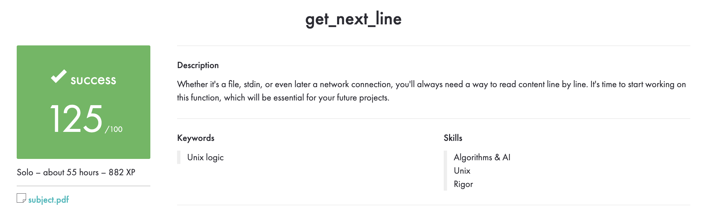

# 📄 get_next_line

> **A line-by-line reader for file descriptors, written in C as part of the 42 School curriculum.**

## 🎯 About the project

`get_next_line` reads from an open file descriptor and returns one line per function call. The returned line includes its trailing newline when one is present. The function returns `NULL` when there is no more input or when a read error occurs.

The project focuses on low-level file I/O, configurable buffers, static storage, and careful dynamic memory management.

## ✨ Features

- 📥 Read input one line at a time with `read()`
- ⚙️ Configure the read buffer at compile time with `BUFFER_SIZE`
- 🧠 Preserve unread bytes between calls
- 📂 Bonus implementation keeps independent state for multiple file descriptors
- 🧩 Separate utility functions and headers for the mandatory and bonus versions

## 📁 Project files

| File | Purpose |
|---|---|
| `get_next_line.c` | Mandatory line-reading implementation |
| `get_next_line_utils.c` | Helpers for the mandatory implementation |
| `get_next_line.h` | Mandatory declarations and definitions |
| `get_next_line_bonus.c` | Multiple-file-descriptor implementation |
| `get_next_line_utils_bonus.c` | Helpers for the bonus implementation |
| `get_next_line_bonus.h` | Bonus declarations and definitions |

## 🛠️ Requirements

- A C compiler such as `cc` or `gcc`
- A POSIX-compatible system

This project does not include a Makefile; compile the source files directly.

## 🚀 Compile

Use your own `main.c` that calls `get_next_line`.

**Mandatory version:**

```bash
cc -Wall -Wextra -Werror -D BUFFER_SIZE=42 \
  main.c get_next_line.c get_next_line_utils.c -o gnl
```

**Bonus version:**

```bash
cc -Wall -Wextra -Werror -D BUFFER_SIZE=42 \
  main.c get_next_line_bonus.c get_next_line_utils_bonus.c -o gnl
```

## 💡 Example

```c
#include "get_next_line.h"
#include <fcntl.h>
#include <stdio.h>
#include <stdlib.h>
#include <unistd.h>

int main(void)
{
    int     fd;
    char    *line;

    fd = open("input.txt", O_RDONLY);
    if (fd < 0)
        return (1);
    while ((line = get_next_line(fd)) != NULL)
    {
        printf("%s", line);
        free(line);
    }
    close(fd);
    return (0);
}
```

Change `BUFFER_SIZE` at compile time to explore how the chunk size affects reading. Free each returned line when you are finished with it.

## 🧠 Skills practiced

- File descriptors and POSIX `read()`
- Buffer management and static storage
- Dynamic memory allocation and cleanup
- Supporting independent state for multiple open files

## 🏅 42 evaluation

The project received a **successful score of 125/100**. The evaluation summary is included below.



## 👩‍💻 Author

**Sedef Akkaya**  
[GitHub](https://github.com/sakkayaa) · [LinkedIn](https://www.linkedin.com/in/sedef-akkaya-0a5580228/)

---

✨ *One call, one line, until the input is complete.*
